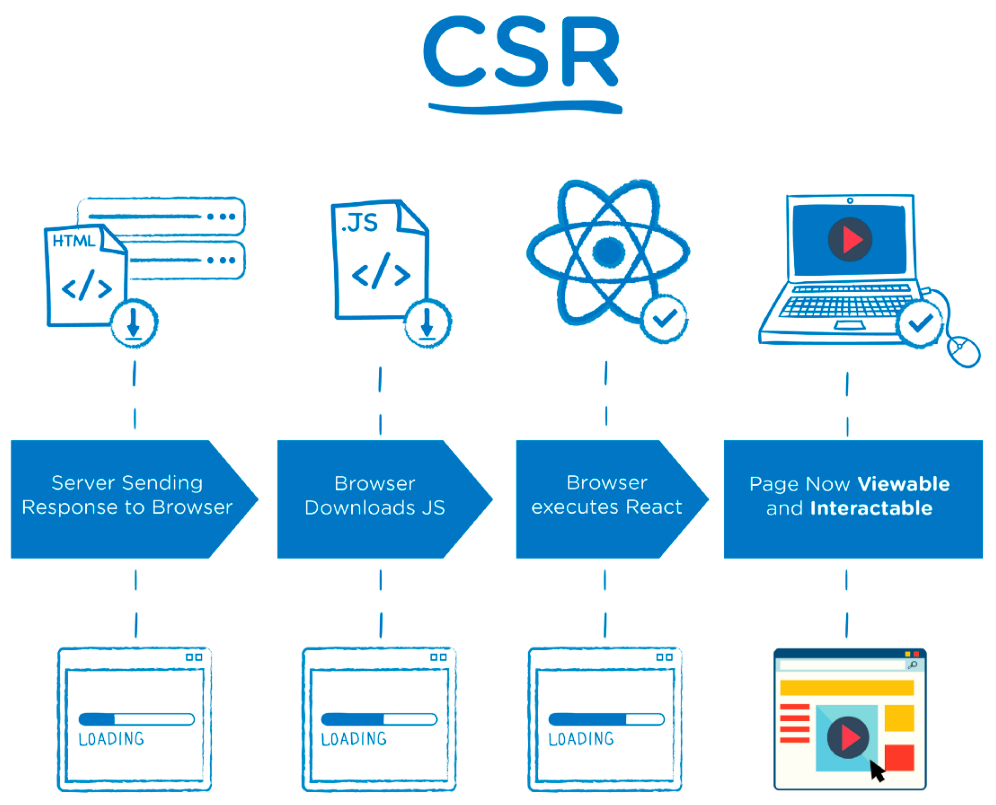
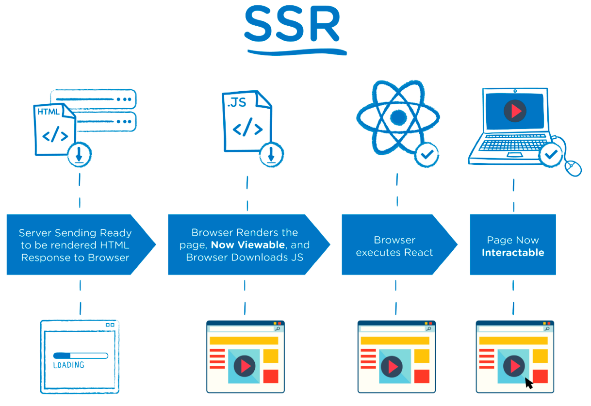

# Portfolio

|  |  |  |  |
| ------------------------------------------------------------ | ------------------------------------------------------------ | ------------------------------------------------------------ | ------------------------------------------------------------ |

개발 시작 : 2021.09.12~

개발 이유 : `나` 의 포트폴리오를 만들어 취업 준비에 활용합니다!


## 1. Summary

- 포트폴리오를 만들어보면서, `React` 와 `Next.js` 를 학습합니다.

- 최신 버전의 코드 스타일과 `Clean Code` 를 작성하기 위해 노력합니다.
- 최대한 라이브러리 없이 기능을 구현합니다. 직접 커스텀 합니다.
- `나` 에 대해 표현할 수 있는 효과적인 수단이 됩니다!


## 2. Step in progress

- 2021.09.12
  - [x] 파일 구조 및 라우팅 구성
  - [x] Nav, Footer 등 공통으로 사용되는 부분 설정
  - [x] greeting, concept 초안


## 3. Settings

- React 17.0.2
- Next.js 11.1.2
- react-dom 17.0.2

and no-library


## 4. Why use Next.js ?

### What is Next.js

> **Next.js** is an [open-source](https://en.wikipedia.org/wiki/Open-source) development framework built on top of [Node.js](https://en.wikipedia.org/wiki/Node.js) enabling [React](https://en.wikipedia.org/wiki/React_(JavaScript_library)) based web applications functionalities such as [**server-side rendering**](https://en.wikipedia.org/wiki/Server-side_scripting) and generating [static websites](https://en.wikipedia.org/wiki/Static_web_page).

👉 React를 SSR로 변환하는 오픈소스!


### CSR(Client Side Rendering) vs SSR(Server Side Rendering)

|        | CSR                                                          | SSR                                                          |
| ------ | ------------------------------------------------------------ | ------------------------------------------------------------ |
| 이미지 |                                 |                                 |
| 정의   | 웹사이트가 클라이언트에서 렌더링되는 것을 의미.              | 웹 사이트가 서버에서 렌더링 되는 것을 의미.                  |
| 장점   | 한 번 로드된 이후에는 이미 모든 페이지가 렌더링 되어 있기 때문에 페이지 이동이 빠르고, 서버에 리소스 요청이 필요 없다. `TTI` 와 `TTV` 가 거의 동시에 이루어진다. | 브라우저에서 요청한 `단일 페이지` 에 대해서 `서버` 가 렌더링을 해서 전달하는 것이기 때문에, 첫 페이지에 대한 로드가 `CSR` 에 비해 빠르다. |
| 단점   | 서비스에 필요한 `모든 페이지` , `모든 리소스` 를 최초 접속시 다 받아오기 때문에 첫 페이지 로드가 `SCR` 에 비해 느리다. | 클라이언트는 서버가 랜더링 해준 것을 보여주기만 하기 때문에, 다른 페이지로 이동할 때마다 서버에 리소스를 요청하고, 매번 다운로드해야 한다. 또한, 페이지 이동시 매번 서버를 호출해야 하기 때문에 서버에 부하가 걸리기 쉽다. `TTI` 와 `TTV` 사이의 시간이 꽤나 존재한다. |

[MDN 문서](https://developer.mozilla.org/ko/docs/Web/Progressive_web_apps/App_structure)를 참고하였으며, 요즈음에는 성능을 위해 `SSR` 과 `CSR` 을 혼용하여 사용하고 있다. 또한 `SSG` 도 사용한다고 한다. 

[^TTV]: Time to View
[^TTI]: Time to Inreract


### So..

이 프로젝트에는 `SSR` 방식을 사용하기 위해 `Next.js` 를 썼습니다. 이를 선택한 이유는 다음과 같습니다.

- `CSR` 과 `SSR`의 이해 및 체감. (지금까지의 프로젝트는 전부 CSR만 경험해봤기 때문에)
- 정적인 사이트이다. (게시판이나, 기타 API 요청에 의해 내용이 동적으로 변하지 않기 때문에 `SSR` 사용에 큰 무리가 없다고 판단.)
- 사용자가 많지 않다.
- `SEO` 를 고려해보자. (배포 후 검색엔진 노출을 노려보기 위해)
- 각 페이지별 용량이 크지 않으며, 사용자와의 상호작용이 적다.


## GIt

### Commit message

| Commit type | content                              |
| ----------- | ------------------------------------ |
| feat        | 새로운 기능에 대한 커밋              |
| fix         | 버그 수정에 대한 커밋                |
| build       | 빌드 관련 파일 수정에 대한 커밋      |
| chore       | 그 외 부수적인 것들에 대한 커밋      |
| ci          | CI관련 설정 수정에 대한 커밋         |
| docs        | 문서 수정에 대한 커밋                |
| style       | 코드 스타일 혹은 포맷 등에 관한 커밋 |
| refactor    | 코드 리팩토링에 대한 커밋            |
| test        | 테스트 코드 수정에 대한 커밋         |


## 5. What i learned

### Next.js

**✅ json 파일 읽어오기**

```react
const conceptList = require('../../../public/data/concept.json')
```

`require` 을 사용하여 간단하게 사용할 수 있다. `parse` 안해도 바로 object 형태로 사용이 가능하다. 


**✅ `className` 여러개 사용하는 방법**

```react
import classNames from 'classnames';
...
className={classNames({[styles.conceptitem]: true, [styles.active]: selectedItem === item})}
```

`react`에서는 공백으로 띄워서 여러개를 사용할 수 있지만, `next.js` 는 지원되지 않는다. 좀 괴상해보이는 모습이지만, 위 처럼 사용하면 조건부 스타일링이 가능하다.


**✅ 함수형 컴포넌트에는 이벤트 함수를 사용할 수 없다.**

**❌ Bad**

```react
<ConceptItem selectedItem={selectedItem} onclick={() => clickItem()} item={ele} key={ ele.title }/>
```

**🟢 Good**

```react
<ConceptItem selectedItem={selectedItem} clickItem={clickItem} item={ele} key={ ele.title }/> // 부모
...
<div onClick={() => clickItem(item)}></div> // 자식
```

컴포넌트에 `onclickItem` 을 사용하면, 이를 `props` 로 인식한다. 이벤트 함수를 사용하기 위해서는 전체를 `div` 등의 html 태그로 묶거나, 자식 컴포넌트에 함수 자체를 `props` 내려서 사용해야 한다.


## 6. Referenced videos and materials

### YouTube

- 코딩앙마, [Next js 강좌](https://www.youtube.com/playlist?list=PLZKTXPmaJk8Lx3TqPlcEAzTL8zcpBz7NP)


### Docs

- [Next.js](https://nextjs.org/)


## 7. Image source

- https://free3dicon.com/

