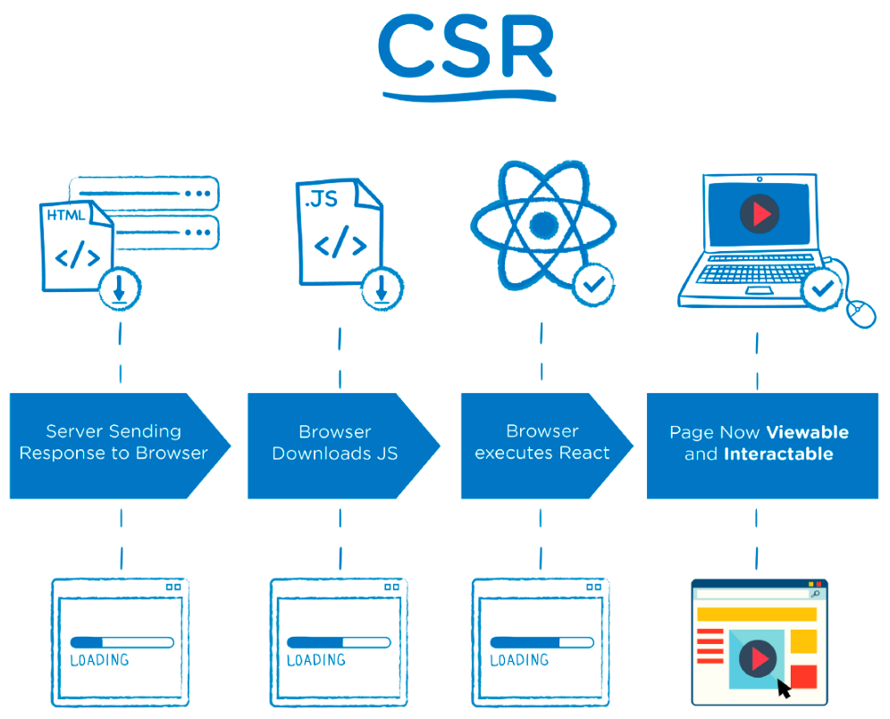
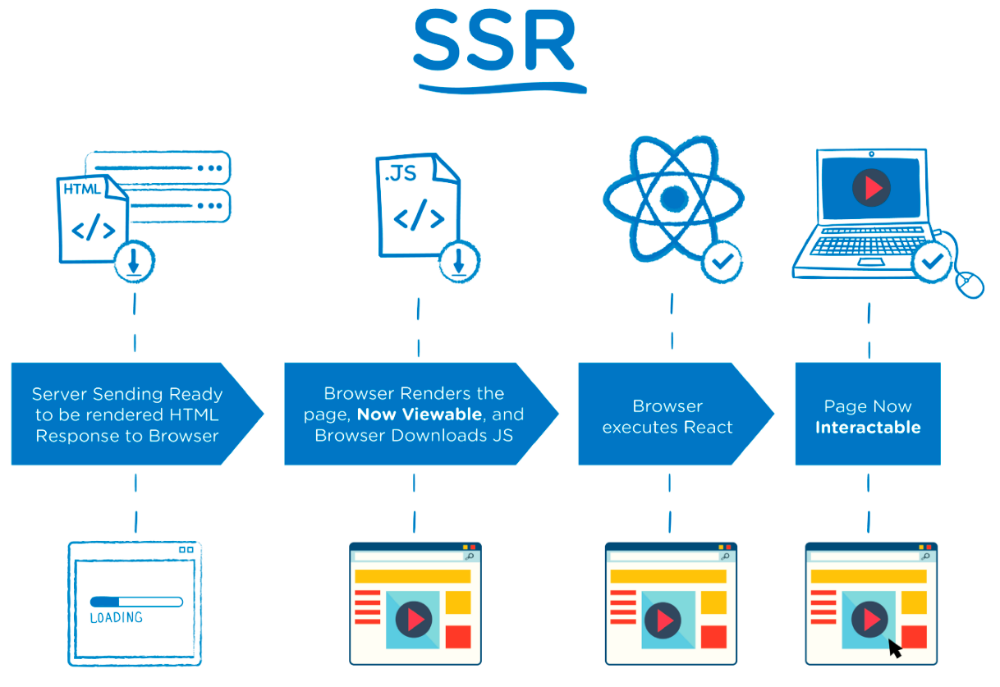

### What is Next.js

> **Next.js** is an [open-source](https://en.wikipedia.org/wiki/Open-source) development framework built on top of [Node.js](https://en.wikipedia.org/wiki/Node.js) enabling [React](https://en.wikipedia.org/wiki/React_(JavaScript_library)) based web applications functionalities such as [**server-side rendering**](https://en.wikipedia.org/wiki/Server-side_scripting) and generating [static websites](https://en.wikipedia.org/wiki/Static_web_page).

👉 React를 SSR로 변환하는 오픈소스!

### CSR(Client Side Rendering) vs SSR(Server Side Rendering)

|        | CSR                                                          | SSR                                                          |
| ------ | ------------------------------------------------------------ | ------------------------------------------------------------ |
| 이미지 |                        |                        |
| 정의   | 웹사이트가 클라이언트에서 렌더링되는 것을 의미.              | 웹 사이트가 서버에서 렌더링 되는 것을 의미.                  |
| 장점   | 한 번 로드된 이후에는 이미 모든 페이지가 렌더링 되어 있기 때문에 페이지 이동이 빠르고, 서버에 리소스 요청이 필요 없다. `TTI` 와 `TTV` 가 거의 동시에 이루어진다. | 브라우저에서 요청한 `단일 페이지` 에 대해서 `서버` 가 렌더링을 해서 전달하는 것이기 때문에, 첫 페이지에 대한 로드가 `CSR` 에 비해 빠르다. |
| 단점   | 서비스에 필요한 `모든 페이지` , `모든 리소스` 를 최초 접속시 다 받아오기 때문에 첫 페이지 로드가 `SCR` 에 비해 느리다. | 클라이언트는 서버가 랜더링 해준 것을 보여주기만 하기 때문에, 다른 페이지로 이동할 때마다 서버에 리소스를 요청하고, 매번 다운로드해야 한다. 또한, 페이지 이동시 매번 서버를 호출해야 하기 때문에 서버에 부하가 걸리기 쉽다. `TTI` 와 `TTV` 사이의 시간이 꽤나 존재한다. |

[MDN 문서](https://developer.mozilla.org/ko/docs/Web/Progressive_web_apps/App_structure)를 참고하였으며, 요즈음에는 성능을 위해 `SSR` 과 `CSR` 을 혼용하여 사용하고 있다. 또한 `SSG` 도 사용한다고 한다. 

[^TTV]: Time to View
[^TTI]: Time to Inreract

### So..

이 프로젝트에는 `SSR` 방식을 사용하기 위해 `Next.js` 를 썼습니다. 이를 선택한 이유는 다음과 같습니다.

- `CSR` 과 `SSR`의 이해 및 체감. (지금까지의 프로젝트는 전부 CSR만 경험해봤기 때문에)
- 정적인 사이트이다. (게시판이나, 기타 API 요청에 의해 내용이 동적으로 변하지 않기 때문에 `SSR` 사용에 큰 무리가 없다고 판단.)
- 사용자가 많지 않다.
- `SEO` 를 고려해보자. (배포 후 검색엔진 노출을 노려보기 위해)
- 각 페이지별 용량이 크지 않으며, 사용자와의 상호작용이 적다.